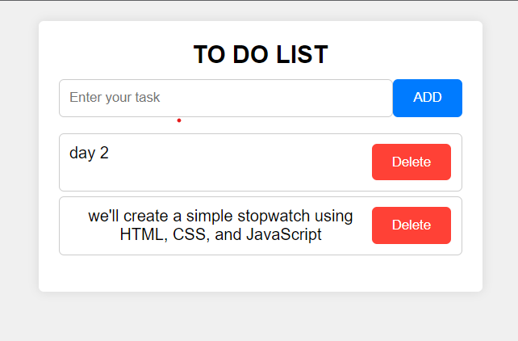

# Day 1: To-Do List App

This is a simple to-do list application created using HTML, CSS, and JavaScript.



## Overview

This project is a basic to-do list application that allows you to add and delete tasks. It's a great starting point for learning about web development using HTML, CSS, and JavaScript.

## Features

- Add tasks to your to-do list.
- Mark tasks as completed.
- Delete tasks when they are no longer needed.

## Usage

1. Clone this repository to your local machine:

   ```bash
   git clone https://github.com/VartikAnand/30-days-30-JS-Projects/tree/main/01
