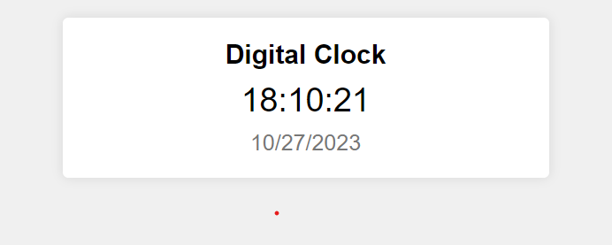

# Project 2: Digital Clock

Welcome to the Digital Clock project! Keep track of time and date with a stylish digital clock created using HTML, CSS, and JavaScript.



## Overview

This project features a simple yet functional digital clock that displays the current time and date. It's a great way to learn about web development while creating a practical tool.

## Features

- Real-time clock with hours, minutes, and seconds.
- Display of the current date.
- Accurate timekeeping.
- Clean and intuitive design.

## Usage

1. Clone this repository to your local machine:

   ```bash
   git clone https://github.com/yourusername/project-2-digital-clock.git
